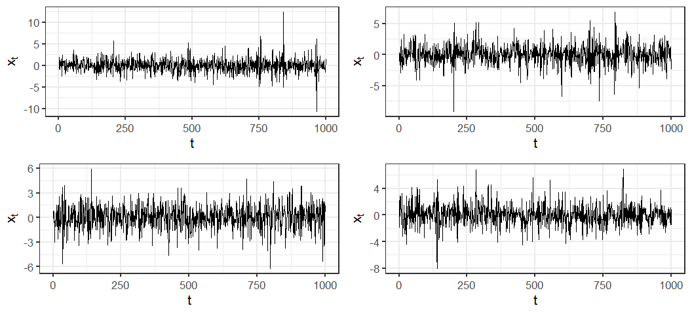
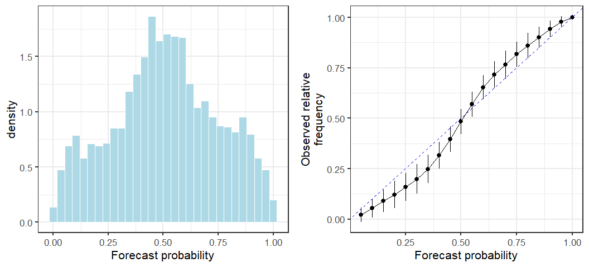

Introduction
------------

It’s January 2021 and Bitcoin price have been breaking all time highs.
In this context I wanted to explore statistical methods for estimating
and forecasting volatility, in particular autoregressive conditional
heteroscedasticity (ARCH) models. Volatility is variation around the
mean return of a financial asset. Low volatility implies prices are
bunched near the mean while high volatility implies large swings in
prices. It is considered a measure of investment risk. For example, we
may be convinced Bitcoin will continue to rise in value over the short
term but reluctant to engage in speculation if there is significant
volatility reducing our chances of being able to buy in and sell at
“good” prices (even if there a upward trend). I’ll add I’m not an expert
on financial markets, and that models and graphs below are coded in R.

``` r
# packages
library(data.table)
library(ggplot2)
```

``` r
# read in data
dt_daily_close <- fread("./bitcoin-daily-close-2012-2020.csv")
```

Bitcoin bull markets
--------------------

To say the Bitcoin (BTC) price has been going up recently was probably
an understatement, the price has gone up more 100% since the beginning
of 2020! Although if we compare with previous bull market in late 2017
where the price went up more than 1000% it is not a unique occurrence in
Bitcoin’s history. Indeed, looking at the graph of Bitcoin on a log
scale below we see that the recent (relative) growth rate is
comparatively low in Bitcoin’s history.


Financial time series basics
----------------------------

It is common in the statistical analysis of financial time series to
transform the asset price in order to achieve something closer to a
series of independent increments ([a random
walk](https://en.wikipedia.org/wiki/Random_walk)). If *B*<sub>*t*</sub>
is the Bitcoin price on day *t*, the daily “log return” is
*Z*<sub>*t*</sub> = *l**o**g*(*B*<sub>*t*</sub>) − *l**o**g*(*B*<sub>*t* − 1</sub>).
Using the log differences might seem rather arbitrary at first but it
can justified as 1) making a multiplicative process additive and 2)
interpretable as the percentage change in asset value. If
*r*<sub>*t*</sub> is the return at time *t* ∈ 1, 2, ..., *T* for a
starting asset value of *W*<sub>0</sub> then
$W\_T = W\_0\\prod\_{t=1}^T(1+r\_t)$. Taking logarithms gives

$$
\\begin{align}
log(W\_T) &= log(W\_0) + \\sum\_{t=1}^T log(1+r\_t) \\\\
 &= \\underbrace{log(W\_0) + \\sum\_{t=1}^{T-1} log(1+r\_t)}\_{log(W\_{T-1})} + log(1+r\_T) \\\\
log(1+r\_T) &= log(W\_T) - log(W\_{T-1})\\\\
\\end{align}
$$

Further for small *r*<sub>*t*</sub> the percentage price is
approximately equal to the log return, i.e. *l**o**g* ≈ *x*. So the
[random-walk
hypothesis](https://en.wikipedia.org/wiki/Random_walk_hypothesis) hopes
that the relative price changes are close to an independent process.

``` r
dt_daily_ret <- dt_daily_close[,.(return = diff(log(Close)))]
dt_daily_ret[,date := dt_daily_close$date[-1]]
```

We can see in the plot below that *Z*<sub>*t*</sub> appears to be a zero
mean process. However, comparing it to a simulated white noise process
we see much greater variation in the magnitude of deviations from the
the mean. The Bitcoin returns also exhibit clustering in their variance
over time. These are characteristics the ARCH model was designed to
account for.


An alternative way to look at a times series is plots of the
autocorrelation function (ACF) and partial autocorrelation function
(PACF). The ACF graphs the correlation between observations at time
*Z*<sub>*t*</sub> and *Z*<sub>*t* − *h*</sub> for various values of *h*.
Since we average over *t* we are assuming that the series is
[stationary](https://en.wikipedia.org/wiki/Stationary_process) -
intuitively that it’s statistical properties don’t depend on *t*. The
PACF graphs the correlation between *Z*<sub>*t*</sub> and
*Z*<sub>*t* − *h*</sub> with all intermediate values
*Z*<sub>*t* − 1</sub>, *Z*<sub>*t* − 2</sub>, ..., *Z*<sub>*t* − *h* + 1</sub>
regressed out. Below are ACF and PACF graphs of the series
*Z*<sub>*t*</sub> and *Z*<sub>*t*</sub><sup>2</sup>. While
*Z*<sub>*t*</sub> appears to have relatively weak patterns the ACF and
PACF of the *Z*<sub>*t*</sub><sup>2</sup> process demonstrates clear
dependence in the process variance.


A formal test of independence of a time-series, the Ljung–Box test,
strongly rejects independence in *Z*<sub>*t*</sub><sup>2</sup> with a
small p-value. We also reject independence of the *Z*<sub>*t*</sub>
increments but this is much weaker signal.

``` r
# test of Z_t
Box.test(dt_daily_ret$return,type = "Ljung-Box")
```

    ## 
    ##  Box-Ljung test
    ## 
    ## data:  dt_daily_ret$return
    ## X-squared = 5.9396, df = 1, p-value = 0.0148

``` r
# test of Z_t^2
Box.test(dt_daily_ret$return^2,type = "Ljung-Box")
```

    ## 
    ##  Box-Ljung test
    ## 
    ## data:  dt_daily_ret$return^2
    ## X-squared = 399.32, df = 1, p-value < 2.2e-16

Autoregressive conditional heteroscedasticity models
----------------------------------------------------

Autoregressive conditional heteroscedasticity (ARCH) models, developed
by Robert Engle in 1982, were designed to account for processes in which
the variance of the return fluctuates. ARCH processes exhibit the time
varying variance and volatility clustering seen in the graph of Bitcoin
returns above. An ARCH(p) series is generated as
$X\_t = \\sqrt h\_t e\_t$, with
*h*<sub>*t*</sub> = *α*<sub>0</sub> + ∑*α*<sub>*i*</sub>*X*<sub>*t* − *i*</sub><sup>2</sup>
and *e*<sub>*t*</sub> ∼ *N*(0, 1). There have been extensions to the
model since 1982 with generalised ARCH (GARCH) and it’s various flavours
(IGARCH, EGARCH, …) which allow more complex patterns such as somewhat
“stickier” volatility clustering.

I always like to try and understand how a model works by either
simulating form it (for statistical models) or using simulated data to
understand it’s performance (for machine learning models). Lets simulate
some examples of an ARCH(1) process to get an idea of how the simplest
version of the process works.

``` r
simulate_arch1 <- function(a0,a1,n=1000L) {
  # function to simulate an ARCH(1) series
  # a0: ARCH constant
  # a1: ARCH AR term
  # n: length of time series
  xt <- numeric(length = n+1)
  ee <- rnorm(n+1)  
  xt[1] <- ee[1]
  for (i in 2:(n+1)) {
    ht <- a0 + a1*xt[i-1]^2
    xt[i] <- ee[i]*sqrt(ht)
  }
  xt[2:(n+1)]
}
```




It is worth remembering that ARCH models are for the volatility, we can
also have usual trends, or additional ARIMA components. For example,
let’s simulate an AR(1) model with ARCH(1) volatility,
$X\_t = u\_0 X\_{t-1} + \\sqrt h\_t e\_t$. The plots of the ACF and PACF
for this series shows similar correlation patterns for both
*X*<sub>*t*</sub> and *X*<sub>*t*</sub><sup>2</sup>.

``` r
simulate_ar1_arch1 <- function(u0,a0,a1,n=1000L) {
  # function to simulate AR(1) + ARCH(1) series
  # u0: autoregressive term
  # a0: ARCH constant
  # a1: ARCH AR term
  # n: length of time series
  xt <- numeric(length = n+1)
  ee <- rnorm(n+1)  
  xt[1] <- ee[1]
  for (i in 2:(n+1)) {
    ht <- a0 + a1*xt[i-1]^2
    xt[i] <- u0*xt[i-1] + ee[i]*sqrt(ht)
  }
  xt[2:(n+1)]
}
```


Modelling Bitcoin volatility
----------------------------

Now that we’ve got an idea of how ARCH models work let’s move onto
modeling Bitcoin returns. We’ll use the R package `fGarch` which
estimates the model parameters using Quasi-Maximum Likelihood
Estimation. I picked an ARCH(2) model based on a quick comparison of
model fit statistics for different values of the heteroscedasdicity
order. The `garchFit` function prints a lot to the console which you can
suppress with `trace = FALSE`.

``` r
# fit an ARCH(2) model to Bitcoin returns
library(fGarch)
m1 <- garchFit(~arma(0,0)+garch(2,0),dt_daily_ret$return,trace=FALSE)
summary(m1)
```

    ## 
    ## Title:
    ##  GARCH Modelling 
    ## 
    ## Call:
    ##  garchFit(formula = ~arma(0, 0) + garch(2, 0), data = dt_daily_ret$return, 
    ##     trace = FALSE) 
    ## 
    ## Mean and Variance Equation:
    ##  data ~ arma(0, 0) + garch(2, 0)
    ## <environment: 0x00000000199e5fd8>
    ##  [data = dt_daily_ret$return]
    ## 
    ## Conditional Distribution:
    ##  norm 
    ## 
    ## Coefficient(s):
    ##        mu      omega     alpha1     alpha2  
    ## 0.0026455  0.0010569  0.2509526  0.2539785  
    ## 
    ## Std. Errors:
    ##  based on Hessian 
    ## 
    ## Error Analysis:
    ##         Estimate  Std. Error  t value Pr(>|t|)    
    ## mu     2.645e-03   6.524e-04    4.055 5.02e-05 ***
    ## omega  1.057e-03   3.843e-05   27.502  < 2e-16 ***
    ## alpha1 2.510e-01   2.827e-02    8.878  < 2e-16 ***
    ## alpha2 2.540e-01   3.296e-02    7.705 1.31e-14 ***
    ## ---
    ## Signif. codes:  0 '***' 0.001 '**' 0.01 '*' 0.05 '.' 0.1 ' ' 1
    ## 
    ## Log Likelihood:
    ##  5898.152    normalized:  1.796027 
    ## 
    ## Description:
    ##  Wed Nov 24 15:03:17 2021 by user: z5110862 
    ## 
    ## 
    ## Standardised Residuals Tests:
    ##                                 Statistic p-Value     
    ##  Jarque-Bera Test   R    Chi^2  58727.98  0           
    ##  Shapiro-Wilk Test  R    W      0.8800886 0           
    ##  Ljung-Box Test     R    Q(10)  26.3782   0.003263477 
    ##  Ljung-Box Test     R    Q(15)  39.05692  0.000628423 
    ##  Ljung-Box Test     R    Q(20)  49.41108  0.0002687736
    ##  Ljung-Box Test     R^2  Q(10)  14.15045  0.1662389   
    ##  Ljung-Box Test     R^2  Q(15)  18.71158  0.2271022   
    ##  Ljung-Box Test     R^2  Q(20)  20.63017  0.4191803   
    ##  LM Arch Test       R    TR^2   15.36755  0.2219489   
    ## 
    ## Information Criterion Statistics:
    ##       AIC       BIC       SIC      HQIC 
    ## -3.589618 -3.582192 -3.589621 -3.586959

Calling `summary` on the resulting model object returns estimates of the
model parameters and Ljung–Box statistics for the residuals and squared
residuals. The model returned is $Z\_t = 0.00265 + \\sqrt h\_t e\_t$
with
*h*<sub>*t*</sub> = 0.001 + 0.251*Z*<sub>*t* − 1</sub><sup>2</sup> + 0.254*Z*<sub>*t* − 2</sub><sup>2</sup>.
Notice that the Ljung-Box test is significant for the residuals but not
squared residuals. The p in `Q(p)` of the Ljung-Box test results
indicates the extent of the autocorrelation lag used in testing for
independence of the residuals. So there is evidence of unaccounted for
correlation in the data when considering lags up to 15 and 20. However,
the ACF and partial ACF suggest that the remaining auto correlation is
somewhat complex and weak enough to ignore for the purposes of
illustrating basic volatility forecasting with ARCH model.

Rolling probabilitic forecast
-----------------------------

One use of such a model may be to forecast the one day ahead
distribution of returns. Our forecasts are of the form
*Z*<sub>*t* + 1</sub> ∼ *N*(0, *α̂*<sub>0</sub> + *α̂*<sub>1</sub>*Z*<sub>*t* − 1</sub><sup>2</sup> + *α̂*<sub>2</sub>*Z*<sub>*t* − 2</sub><sup>2</sup>).
These forecasted distributions can be used to assess the probability of
price movements of a particular size. Since we might believe the
parameters of the model are not constant I’ll use a rolling forecast
window of 300+1 days. So starting at day 301 (2012-10-26) until the
final day 3,285 (2020-12-31) I’ll fit an ARCH(2) model to the previous
300 days and forecast forward one day. We can see in the results that
there is considerable room for improvement, the model fails to capture
many of the large price movements, but that it is not producing complete
nonsense either.


Assessing the forecasts
-----------------------

A more thorough evaluation of the forecasts involves assessing their
calibration and dispersion (I won’t go into details on this aspect, see
for example Gneiting and Katzfuss (2014)). From the graphs below we see
that our forecasts are poorly calibrated - the forecasted probabilities
of price movement are not reliable. They are likely to over estimate the
probability of a large price movement (overdispersion).



We might wonder whether the poor performance came about due to the large
drop in March 2020 influencing future predictions. However, this doesn’t
appear to be the case. The prediction strategy I used is simply not
good!


That’s all!
-----------

Thanks for reading. This was a relatively simplistic introduction to the
use of ARCH models for forecasting volatility in the Bitcoin market.
ARCH models allow the variance of time series at time *t* to depend on
the variance of previous terms *t* − 1, *t* − 2, ..., analogous to how
autoregressive models. This allows us to forecast distributions of
future prices in a manner that is more reflective of empirical
observations of financial time series.

Reading and links
-----------------

-   Gneiting, T., & Katzfuss, M. (2014). Probabilistic forecasting.
    Annual Review of Statistics and Its Application, 1, 125-151.  
-   Engle, R. F. (1982). Autoregressive conditional heteroscedasticity
    with estimates of the variance of United Kingdom inflation.
    Econometrica: Journal of the Econometric Society, 987-1007.  
-   Bollerslev, T. (1986). Generalized autoregressive conditional
    heteroskedasticity. Journal of econometrics, 31(3), 307-327.  
-   Data source:
    <a href="https://www.kaggle.com/mczielinski/bitcoin-historical-data" class="uri">https://www.kaggle.com/mczielinski/bitcoin-historical-data</a>  
-   fGarch R package:
    <a href="https://cran.r-project.org/web/packages/fGarch/fGarch.pdf" class="uri">https://cran.r-project.org/web/packages/fGarch/fGarch.pdf</a>
