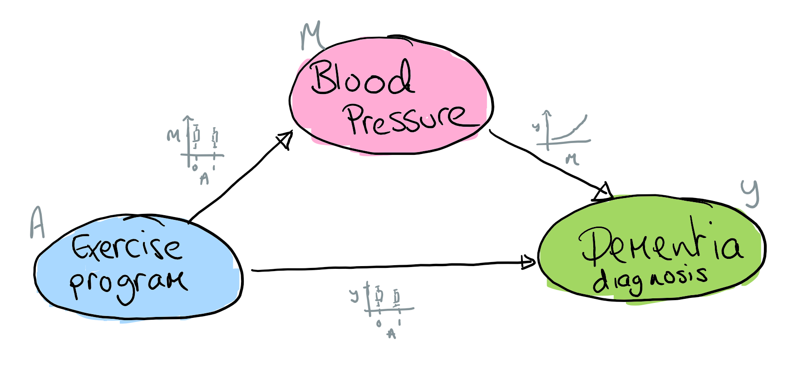
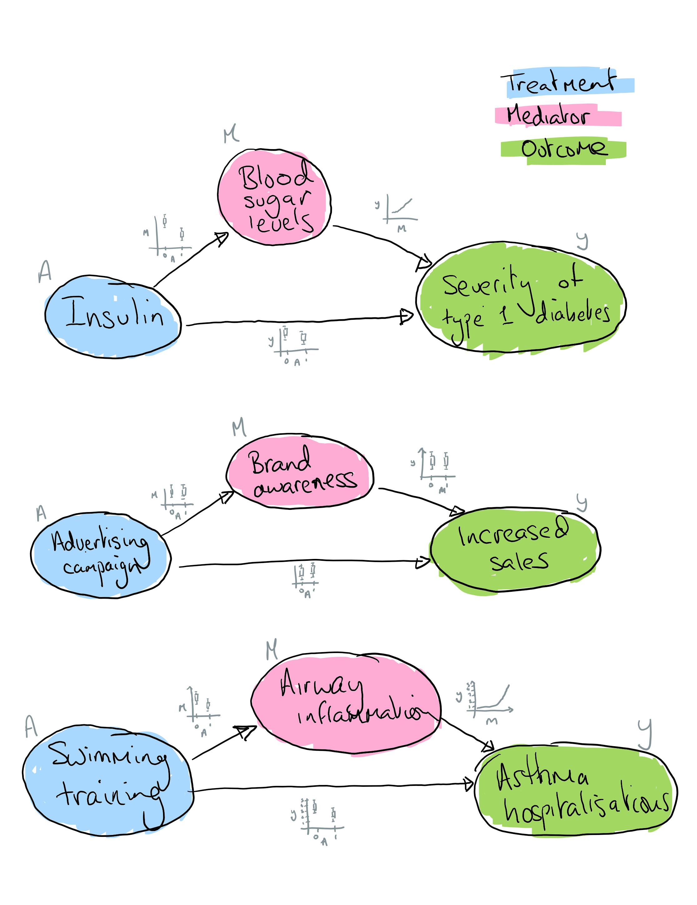
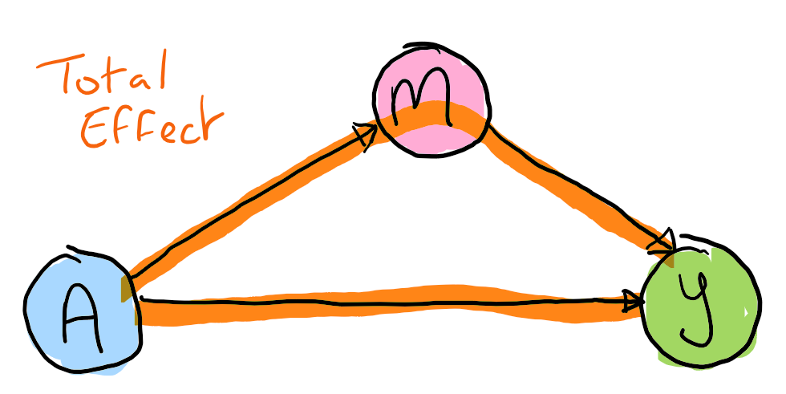
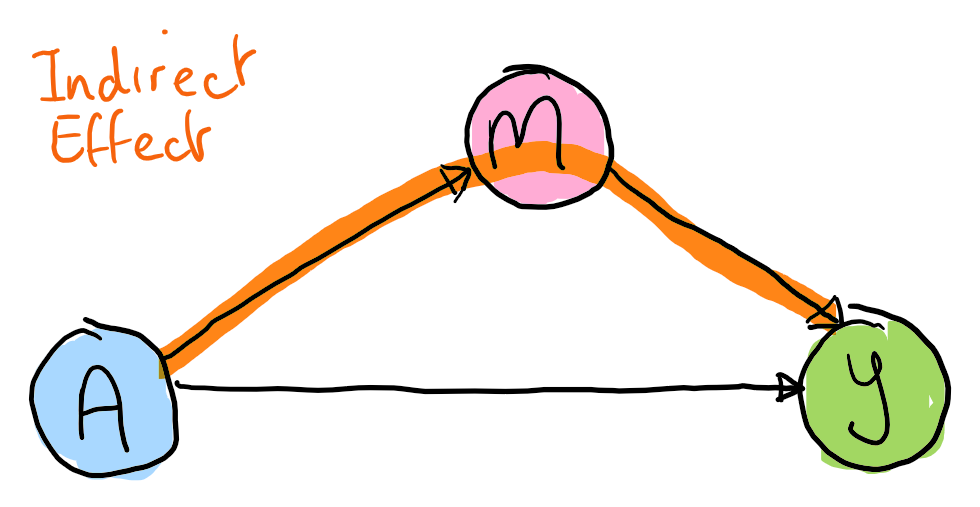
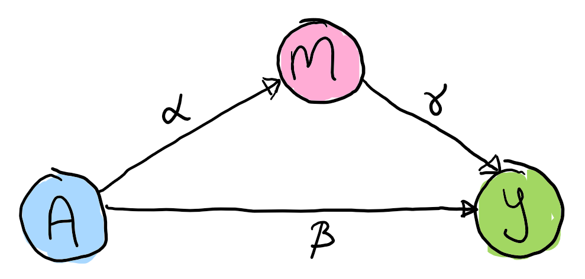
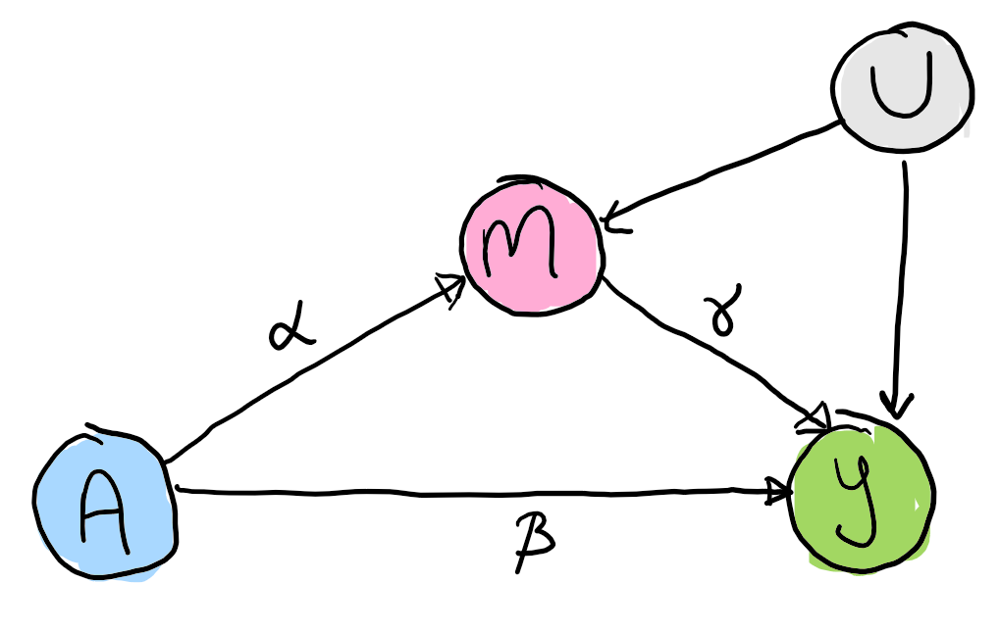

---

I recently worked on the meta-analysis of a set of randomised control trials (RCT), and as part of this carried out a series of causal mediation analyses. I'd never thought about mediation in an RCT setting before. It was interesting to realise that even in a perfectly designed experiment with full randomisation of the treatment there is a need to think carefully about risk of confounding. 

---

## Introduction

As described by Judea Pearl causal mediation is an attempt to explain how nature works. It attempts to quantify the extent to which the effect of an action (the treatment) on a outcome of interest can be explained by a particular mechanism (the mediator).  Of course, the extent to which we are "explaining nature" is necessarily limited by the data available. As an example exercise may reduce an individuals risk of dementia because it reduces blood pressure. A [directed acyclic graph](https://en.wikipedia.org/wiki/Directed_acyclic_graph) that encodes this structure is shown below. This graph says that exercise impacts risk of dementia **indirectly** through changes in blood pressure and also **directly**, possibly through some other unmeasured mechanism.

{width=50%} 

There are several effects of interest in a mediation analysis, relating to which pathway (direct/indirect) and node (treatment/mediator) we wish to consider intervening on and if we want to imagine keeping some aspect of the treatment fixed at a baseline/control level. Some notation, there are two treatment levels $A \in \{0,1\}$ with an outcome $Y$, and potential outcome $Y(a)$, the outcome observed if we set $A = a$. By consistency, in our observed data $Y = Y(1)$ if $A = 1$ and similarly for $A = 0$. The mediator $M$ also has potential outcomes $M(0)$ and $M(1)$. Within mediation analysis there is a second potential outcome $Y(a,m)$ that arises if we consider setting both $A$ and $M$ to particular values. This potential outcome also allows us consider questions such as: what value would the outcome take if an individual is treated $A=1$ but the treatment-mediator pathway is "broken" $M=M(0)$ denoted as $Y(1,M(0))$. Other variables will be denoted $X$, $Z$, ... as required. I generally assume some level of familiarity with causal inference, a good introduction is [Hernan and Robin's book](https://www.hsph.harvard.edu/miguel-hernan/causal-inference-book/). 

Some other examples of the type of questions for which causal mediation analysis is useful:  

{width=60%} 

## Quantities of interest 

There are several quantities (statistical/causal estimands) of interest in a mediation analysis. The naming conventions are different depending on the literature I've read and here I stick with Pearl (2014).

### Total effect

The total effect is the change in the outcome if we flip the treatment switch and aren't concerned with the mechanism of action. It is the usual average treatment effect figure we might expect to see in the headline results of an RCT. We could collapse the graph below into $A \rightarrow Y$.

$\text{TE} = E(Y(1) - Y(0))$

{width=40%}

### Direct effect

The natural direct effect is the effect of flipping the treatment switch if we imagine that the indirect pathway is no longer operational.

$\text{DE} = E(Y(1,M(0)) - Y(0,M(0)))$

{width=40%}

### Indirect effect

The natural direct effect (or average mediated effect) is the effect of flipping the treatment switch if we imagine that the direct pathway is no longer operational. 

$\text{IDE} = E(Y(0,M(1)) - Y(0,M(0)))$

{width=40%}

Each of these effects may be useful for different purposes. For example, the total effect may guide immediate decision making and policy - if a treatment works and is immediately needed the mechanism of action is less important. The size of the indirect effect is useful information for considering alternative (e.g. cheaper) treatments that target the mediator. The value $\text{IDE}/\text{TE}$ is considered the percentage of the total effect explained by the mediator.  

## Mediation and exchangeability

One of the important considerations in any causal analysis is exchangeability/ignorability. Also referred to as unconfoundedness, we can think of exchangeability as meaning that individuals in either treatment arm are literally a-priori exchangeable or "swappable", with the conditionaly exchangeability meaning that individuals are swappable within strata of a covariates X. We want our analysis to be comparable to a RCT, you could have ended up in either treatment arm. What exchangeability achieves is a lack of dependence between the treatment assignment and the potential outcome under that treatment $Y(a) \perp A$. Otherwise you end up with flawed analysis. For example, assume that in truth exercise $A$ reduces risk of hospitalisations due to asthma $Y$, and we wish inpractise to investigate the link using survey of all asthmatics who have attended a clinic. However, only mild asthmatics do any exercise training ($A=1$) and already have fairly low risk of hospitalisations. So a naive analysis might find that exercise increases risk of hospitalisations. We have set up a scenario where our naive treatment estimator cannot equal the true treatment effect $E(Y|A=1) - E(Y|A=0) \ne E(Y(1) - Y(0))$. Clearly severity of asthma $X$ would be an important adjustment and we might be happy to consider treatment assigment random within levels of an asthma severity measure $X$ leading to conditional exchangeability $Y(a) \perp A | X = x$. 

Now that we've recapped exchangeability in general lets consider it for mediation. In particular I'm going to talk about RCTs and so will assume the initial treatment $A$ is fully randomised and unconfounded. An issue here is rather simply that we've randomised only the treatment and so any mediation analysis can still be confounded. For example, exercise could reduce asthma hospitalisation, with the potential mechanism being a reduction in inflammation. But if some individuals in our study live in an area with a pollutant that raises lung inflammtion and increases our risk of asthma hospitalisation we have a partially confounded analysis. What will happen then is that estimates of the indirect and direct effects will be biased away from the true effect. 

{width=50%}

## Simulations 

Let's investigate this issue around confounding and mediation analysis using some simple linear forms for our data generation process and models.

### 0. An unconfounded mediation model

First lets clarify what we are attempting to estimate.

{width=50%}

Assuming no confounding in our generative model we can estimate the total, direct and indirect effects using estimators of the following quantities, for the total effect we have

\begin{align}
\text{TE} &= E(Y(1) - Y(0)) \\
 &= E(Y|A=1) - E(Y|A=0) \\
 &= \int_{\mathcal{M}} E(Y|M=m,A=1)p(M|A=1) - \int_{\mathcal{M}} E(Y|M=m,A=0)p(M|A=0) \\ \
 &= \gamma*E(M|A=1) + \beta - \gamma*E(M|A=0) \\
 &= \gamma*\alpha + \beta
\end{align}

And the direct effect we have

\begin{align}
\text{DE} &= E(Y(1,M(0)) - Y(0,M(0))) \\
 &= E(Y(1,M(0))) - E(Y(0,M(0))) \\ 
 &= \int_{\mathcal{M}} E(Y|M=m,A=1)p(M|A=0) dm - \int_{\mathcal{M}} E(Y|M=m,A=0)p(M|A=0) dm \\
 &= \int_{\mathcal{M}} (\gamma*m + \beta) p(M|A=0) dm - \int_{\mathcal{M}} (\gamma*m) p(M|A=0) dm \\
 &= \beta
\end{align}

And the indirect effect we have  

\begin{align}
\text{IDE} &= E(Y(0,M(1)) - Y(0,M(0))) \\
 &= E(Y(0,M(1))) - E(Y(0,M(0))) \\ 
 &= \int_{\mathcal{M}} E(Y|M=m,A=0)p(M|A=1) dm - \int_{\mathcal{M}} E(Y|M=m,A=0)p(M|A=0) dm \\
 &= \int_{\mathcal{M}} (\gamma*m) p(M|A=1) dm - \int_{\mathcal{M}} (\gamma*m) p(M|A=0) dm \\
 &= \gamma * E(M|A=1) \\
 &= \gamma * \alpha
\end{align}

We'll estimate these coefficients using R's `lm` function. Obviously in reality we'd need to worry about whether a linear model is the appropriate functional form for our analyses, see Pearl (2014) for details more general versions of these formulas. From the graph below we see that in the unconfounded case we have unbiased estimates of our parameters - as expected! 


```r
mediation_scen0 <- function(N,alpha,beta,gamma) {
  A <- rbinom(N,1,0.5)
  M <- alpha*A + rnorm(N)
  Y <- beta*A + gamma*M + rnorm(N)
  
  alpha_ <- mean(M[A==1]) - mean(M[A==0])
  mod <- lm(Y ~ A + M)
  beta_ <- as.numeric(coef(mod)["A"])
  gamma_ <- as.numeric(coef(mod)["M"])
  tau_ <-  mean(Y[A==1]) - mean(Y[A==0])
  
  c("total" = beta_ + alpha_*gamma_,
    "direct" = beta_,
    "indirect" = alpha_*gamma_)
}
```


<!-- -->

### 1. A confounded mediation model

We now make M and Y to be shared caused of another variable $U$. This results in biased estimates of the direct and indirect effect as seen in the graph below.

{width=50%}

In this case the our estimate of the indirect effect is biased, too high, i.e. generally $\hat{\alpha}\hat{\gamma} > \alpha\gamma$ while the direct effect is too low. If $U$ is >0 (<0) then both M and Y are more likely to take a higher (lower) value which gets absorbed into the $\hat{\alpha}\hat{\gamma}$ estimate. 


```r
mediation_scen1 <- function(N,alpha,beta,gamma) {
  A <- rbinom(N,1,0.5)
  U <- rnorm(N)
  M <- alpha*A + U + rnorm(N)
  Y <- beta*A + gamma*M + U + rnorm(N)
  
  alpha_ <- mean(M[A==1]) - mean(M[A==0])
  mod <- lm(Y ~ A + M)
  beta_ <- as.numeric(coef(mod)["A"])
  gamma_ <- as.numeric(coef(mod)["M"])
  tau_ <-  mean(Y[A==1]) - mean(Y[A==0])
  
  c("total" = beta_ + alpha_*gamma_,
    "direct" = beta_,
    "indirect" = alpha_*gamma_)
}
```

<!-- -->

### 2. Measured confounding

If we knew there was confounding of $M$ and $Y$ by $U$ and we measured $U$ we could estimate the direct and indirect effects while controlling for $U$. THis would fix our biases - see the graph!


```r
mediation_scen2 <- function(N,alpha,beta,gamma) {
  A <- rbinom(N,1,0.5)
  U <- rnorm(N)
  M <- alpha*A + U + rnorm(N)
  Y <- beta*A + gamma*M + U + rnorm(N)
  
  alpha_ <- mean(M[A==1]) - mean(M[A==0])
  mod <- lm(Y ~ A + M + U)
  beta_ <- as.numeric(coef(mod)["A"])
  gamma_ <- as.numeric(coef(mod)["M"])
  tau_ <-  mean(Y[A==1]) - mean(Y[A==0])
  
  c("total" = beta_ + alpha_*gamma_,
    "direct" = beta_,
    "indirect" = alpha_*gamma_)
}
```

<!-- -->

## Conclusion 

THis post was a quick introduction to mediation analysis and one of the potential issues that can crop up - confounding of the mediator and outcome. Measure your confounders, achieve anything. Thanks for reading.

### References

* Pearl, J. (2014). Interpretation and identification of causal mediation. Psychological methods, 19(4), 459: https://ftp.cs.ucla.edu/pub/stat_ser/r389.pdf  


